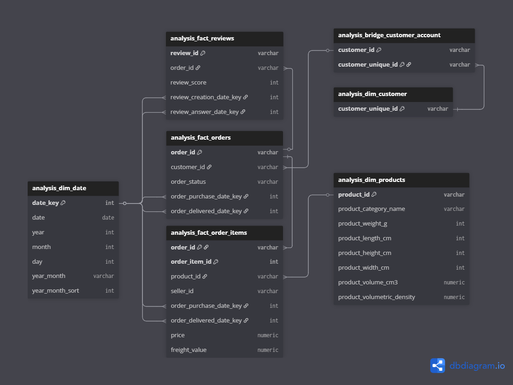

# Olist E-commerce Analytics

This project analyzes the performance of an e-commerce marketplace using the Olist public dataset.

It implements a structured analytical pipeline **staging → analysis → dashboard**, with emphasis on:

* grain enforcement
* explicit star-schema modeling
* centralized calendar architecture
* event-driven KPI evaluation
* referential integrity validation

The objective is analytical correctness and structural consistency.

---

## Dataset Overview

* ~100,000 total orders
* ~96,000 delivered orders
* ~33,000 active products
* ~96,000 customer reviews
* Time span: 2016–2018
* Currency: BRL (R$)

Key data characteristics:

* heterogeneous grains (orders, items, reviews)
* non-delivered operational events
* temporal skewness in early months

The analytical model handles grain heterogeneity explicitly through separate fact tables.

---

## Project Goal

Design a defensible analytical model capable of answering:

* How does marketplace demand evolve over time?
* Are deliveries meeting customer expectations?
* What is the quality and responsiveness of customer feedback?
* How concentrated is revenue across product categories and customers?
* Do customers return and place multiple orders?

The emphasis is structural validity and event consistency.

---

## Data Model

Star schema with event-aligned fact tables and a shared calendar dimension.

  

### Fact Tables

* **analysis_fact_orders**
  Grain: 1 row = 1 `order_id`

* **analysis_fact_order_items**
  Grain: 1 row = 1 (`order_id`, `order_item_id`)

* **analysis_fact_reviews**
  Grain: 1 row = 1 `review_id`

### Dimensions

* **analysis_dim_date** (shared calendar)
* **analysis_dim_customer**
* **analysis_bridge_customer_account**
* **analysis_dim_products**

### Key Modeling Decisions

* Natural keys are preserved where stable.
* `analysis_fact_order_items` inherits date keys from orders.
* Customer identity is resolved through a bridge between `customer_id` and `customer_unique_id`.
* A single shared calendar dimension replaces role-playing calendars.

---

## Date Architecture

`analysis_dim_date` connects to:

* `analysis_fact_orders[order_purchase_date_key]` (active)
* `analysis_fact_orders[order_delivered_date_key]` (inactive)
* `analysis_fact_order_items[order_purchase_date_key]` (inactive)
* `analysis_fact_order_items[order_delivered_date_key]` (inactive)
* `analysis_fact_reviews[review_creation_date_key]` (inactive)
* `analysis_fact_reviews[review_answer_date_key]` (inactive)

Temporal switching is controlled explicitly in DAX via `USERELATIONSHIP`.

This ensures:

* deterministic filter propagation
* no ambiguous time paths
* stable aggregation across order and item grain
* independent evaluation of purchase, delivery, and review events

---

# Dashboard

  

  

  

The dashboard is divided into three analytical sections:

1. Executive Overview
2. Operations Overview
3. Customer & Product Overview

All sections rely on the same semantic model.

---

## Executive Overview — Key Numbers

* Delivered Orders: ~96K
* Total Revenue: ~R$ 13.18M
* Average Order Value: ~R$ 137
* Revenue growth trend visible across 2017–2018

Interpretation:

* Revenue growth tracks order growth.
* Order volume increases structurally over time.
* AOV remains stable relative to volume expansion.

Revenue metrics are evaluated using **purchase date**.
Delivered order metrics use **delivery date**.

---

## Operations Overview

* Average Delivery Delay: ~−12 days
* Late Delivery Rate: ~6.8%
* P98 Delivery Delay: 11 days
* Average Package Weight: ~2.3 kg
* Freight Cost per Kg: ~9.5 R$/Kg

Interpretation:

* Deliveries occur earlier than estimated on average.
* Late deliveries represent a limited fraction of fulfilled orders.
* Tail-risk deliveries are captured by percentile metrics.
* Freight efficiency is normalized by shipment mass.

Logistics KPIs are evaluated using **delivery date**.

---

## Customer & Product Overview

* Repeat Customer Rate: ~3.1%
* Orders with Feedbacks: ~98–99%
* Review Response Coverage: ~100%
* Average Review Score: ~4.1 / 5

Interpretation:

* Most customers place a single order within the observed window.
* Review participation is structurally high.
* Customer satisfaction remains consistently above 4.
* Revenue concentration is visible across top product categories.

Customer retention metrics are aligned with **purchase date**.
Review metrics are aligned with **review creation date**.

---

## KPI Design Principles

All KPIs follow explicit structural rules:

* numerator and denominator semantic alignment
* strict grain consistency
* explicit event-driven time logic
* defensive DAX patterns (`DIVIDE`, explicit filters, controlled relationships)
* no uncontrolled cross-grain propagation

Event alignment:

* Revenue → purchase date
* Delivery performance → delivered date
* Reviews → review creation date

---

## Technologies Used

* Power Query (M) — ingestion and transformation
* Power BI — semantic modeling and visualization
* DAX — metric definitions
* Star schema modeling principles
* GitHub — documentation and version control
* Data source from [Kaggle](https://www.kaggle.com/datasets/olistbr/brazilian-ecommerce/data). License: CC BY-NC-SA 4.0

---

## Why This Project Matters

This project demonstrates the ability to:

* model transactional systems at multiple grains
* enforce deterministic temporal logic within a single shared calendar
* propagate date keys across facts to preserve filter stability
* design analytically defensible KPIs
* maintain referential integrity across bridge-resolved entities
* translate data-model structure into coherent executive dashboards
