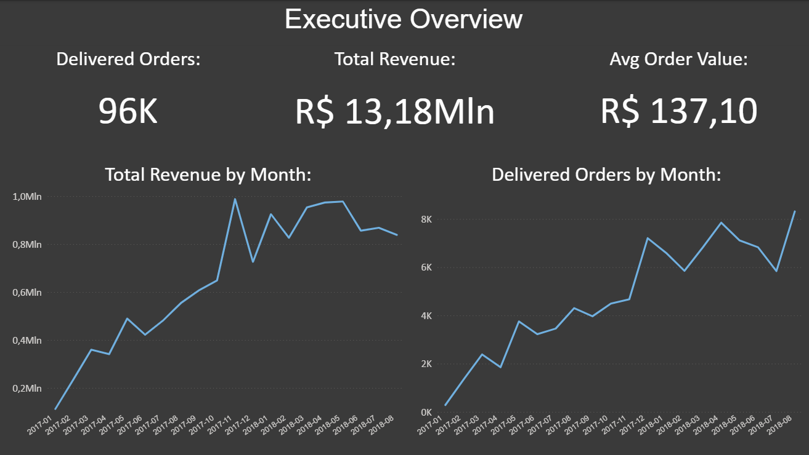
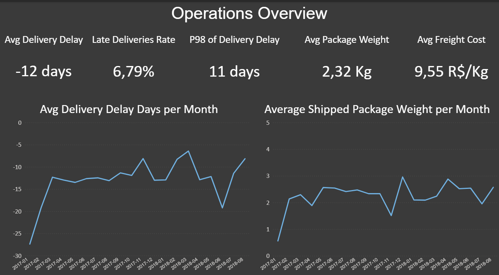
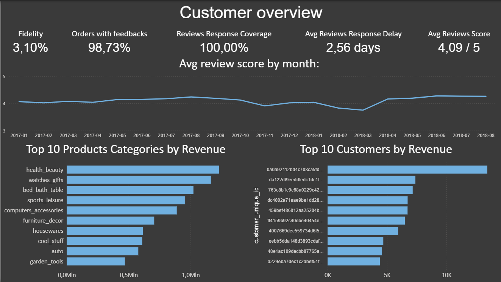

# Olist E-commerce — Executive, Operations & Customer Dashboard

This dashboard provides an integrated analytical view of the Olist e-commerce model, combining:

* commercial performance
* operational execution
* customer behavior
* product mix and revenue concentration

All metrics are derived from a star-schema model based on:

* three fact tables (`analysis_fact_orders`, `analysis_fact_order_items`, `analysis_fact_reviews`)
* three analytical dimensions (`analysis_dim_date`, `analysis_dim_customer`, `analysis_dim_products`)
* one customer bridge (`analysis_bridge_customer_account`)
* a single shared calendar dimension (`analysis_dim_date`)

Event switching is controlled through active and inactive relationships using `USERELATIONSHIP`.

---

# 1. Executive Overview

  

## KPIs

**Delivered Orders**
Distinct count of `order_id` where `order_status = "delivered"`, evaluated using `order_delivered_date_key`.

**Total Revenue**
Sum of `analysis_fact_order_items[price]` for delivered orders.
Revenue is attributed to the purchase event (`order_purchase_date_key`).

**Average Order Value (AOV)**
`Total Revenue / Delivered Orders`.

Revenue is calculated at item grain and aggregated to order level through the header relationship.

## Visuals

**Total Revenue by Month**
Purchase-date aligned revenue trend.

**Delivered Orders by Month**
Delivery-date aligned operational throughput.

## Time Logic

* Revenue metrics use `order_purchase_date_key` (commercial event).
* Delivered order metrics use `order_delivered_date_key` via `USERELATIONSHIP` (operational event).

This enforces semantic separation between demand generation and fulfillment execution.

---

# 2. Operations Overview

  

## KPIs

**Average Delivery Delay (Days)**
Mean difference between `order_delivered_date` and `order_estimated_delivery_date`.
Negative values indicate early delivery.

**Late Delivery Rate**
Share of delivered orders where actual delivery exceeds the estimated date.

**P98 Delivery Delay**
98th percentile of delivery delay distribution.
Captures tail risk in logistics performance.

**Average Package Weight (Kg)**
Total shipped weight divided by number of orders.
Weight derived from `analysis_dim_products[product_weight_g]`.

**Freight Cost per Kg**
`SUM(freight_value) / total_weight_kg`.
Measures cost efficiency normalized by physical shipment mass.

## Visuals

**Avg Delivery Delay per Month**
Delivery-date aligned monthly delay trend.

**Average Shipped Package Weight per Month**
Delivery-date aligned physical shipment trend.

## Time Logic

All logistics metrics are evaluated using `order_delivered_date_key`.
Delivery KPIs explicitly activate the delivery relationship in DAX.

Operational performance is therefore attributed to the moment fulfillment occurs.

---

# 3. Customer Overview

  

## KPIs

**Fidelity Rate**
Share of customers placing more than one order.
Calculated at `customer_unique_id` grain.

**Orders with Feedbacks**
Share of orders that received at least one review.

**Review Response Coverage**
Share of reviews with a non-null `review_answer_date`.

**Average Review Response Delay**
Mean difference between `review_creation_date` and `review_answer_date`.

**Average Review Score**
Mean of `analysis_fact_reviews[review_score]`.

## Visuals

**Average Review Score by Month**
Trend of customer satisfaction over time (review creation date context).

**Top 10 Product Categories by Revenue**
Revenue aggregated at item grain and grouped by `analysis_dim_products[product_category_name]`.

**Top 10 Customers by Revenue**
Revenue aggregated by `customer_unique_id` through bridge resolution.

## Time Logic

* Customer retention and revenue concentration metrics use purchase-date alignment.
* Review metrics use `review_creation_date_key`.
* Response-time metrics use review event dates.

This ensures that feedback analysis is temporally independent from purchase and delivery events.

---

# Data Model Alignment

## Fact Tables

* `analysis_fact_orders`
  Grain: 1 row = 1 `order_id`
  Keys: `order_purchase_date_key`, `order_delivered_date_key`

* `analysis_fact_order_items`
  Grain: 1 row = 1 (`order_id`, `order_item_id`)
  Inherits order-level date keys
  Contains `price` and `freight_value`

* `analysis_fact_reviews`
  Grain: 1 row = 1 `review_id`
  Keys: `review_creation_date_key`, `review_answer_date_key`

## Dimensions

* `analysis_dim_date` (shared calendar)
* `analysis_dim_customer`
* `analysis_bridge_customer_account`
* `analysis_dim_products`

## Relationship Structure

* Date → Orders (purchase active, delivery inactive)
* Date → Order Items (inherited keys)
* Date → Reviews (creation & answer keys)
* Customer resolved via bridge
* Products linked at item grain
* Order header connects items and reviews

All analytical metrics respect their originating fact grain.

---

# Design Summary

The dashboard maintains strict separation between:

* commercial event (purchase)
* operational event (delivery)
* feedback event (review)

Temporal context is explicitly controlled via date keys and `USERELATIONSHIP`.

Revenue, logistics efficiency, customer retention, and satisfaction are analyzed within a unified semantic framework, ensuring cross-event analytical consistency while preserving grain integrity.
